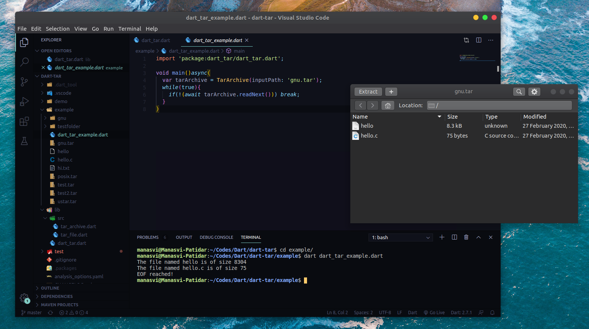

A library for Dart developers.

Created from templates made available by Stagehand under a BSD-style
[license](https://github.com/dart-lang/stagehand/blob/master/LICENSE).

## Usage

A simple usage example:

```dart
import 'package:dart_tar/dart_tar.dart';

void main()async{
  var tarArchive = TarArchive(inputPath: 'gnu.tar');
  while(true){
    if(!(await tarArchive.readNext())) break;
  }
}
```
## Demo

